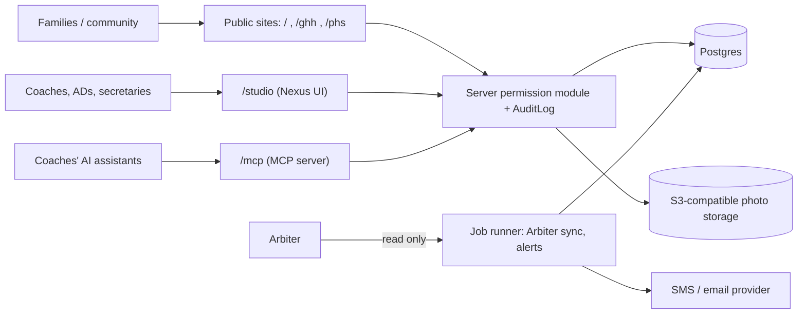

# Planned architecture

**Consult this page** when starting any feature: it says what to build where and which decisions are already locked. None of it is implemented; what exists is in [current app state](current-app.md). `docs/PLAN.md` (to be written as the first PR, see the [kickoff sequence](../planning/roadmap-and-decisions.md#kickoff-sequence-docskickoffmd)) will record the open choices below and supersede this page where it differs.

## Shape

One Next.js App Router app (DECISIONS #4: the public sites, the Studio and the MCP endpoint must share one permission module).

Diagram: intended components from `docs/SPEC.md` and `CLAUDE.md`; none are built.

Routes (see [surfaces and routes](../product/surfaces-and-routes.md)): `/` hub, `/ghh`, `/phs`, `/studio`, `/mcp`. Each public page pattern is built **once** as a shared template parameterized by a school theme ([design system](../design/brand-and-design-system.md)).

## Decided vs open

| Topic | Status |
|---|---|
| Framework: Next.js 16 App Router, React 19, strict TS | Decided (template) |
| Tests: Vitest + Testing Library; Playwright + axe added in Phase 1 | Decided |
| Single app, not monorepo | Decided (DECISIONS #4) |
| Package manager bun; CI via org reusable workflows | Decided ([CI](../operations/ci-and-workflow.md)) |
| MCP tool names `psd_<system>_<resource>_<verb>` | Decided ([MCP](../integrations/mcp-server-and-agents.md)) |
| Database and typed ORM (migrations committed), photo storage (S3-compatible), Auth.js with Google limited to `psd401.net`, job runner, TypeScript MCP SDK | To choose and record in `docs/PLAN.md` |
| Hosting: AWS `us-west-2` (Amplify vs CDK, account) | Unconfirmed; do not provision or add IaC |
| Whether MCP sits behind a gateway | Open question #16 |

## Cross-cutting invariants to design around

- The single permission module enforces [roles and privacy rules](../domain/roles-permissions-privacy.md) for web and MCP alike; every mutation writes an `AuditLog` row with an undo window (see [data model](../domain/data-model.md)).
- Arbiter is read-only source of truth ([schedule sync](../integrations/schedule-sync-and-alerts.md)). Phases 1–2 run on seed fixtures so public sites work before Arbiter access exists.
- Friday-night traffic: cache/pre-render schedule and game pages, revalidate on sync; LCP under 2.5 s on mid-range phone over 4G (SPEC §10).
- No drag-and-drop page builder, no ParentSquare integration.

## Change guidance

Test-first for non-trivial logic (permissions, sync rules, photo holds). Record choices you make in `docs/DECISIONS.md` and questions for the district in `docs/QUESTIONS.md` in the same PR ([roadmap](../planning/roadmap-and-decisions.md)).
