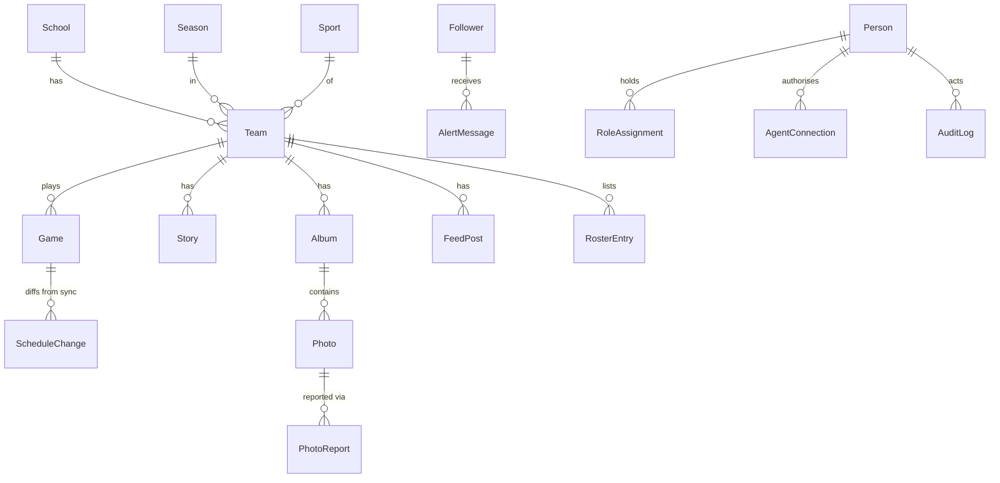

# Planned data model

**Consult this page** when writing migrations, the seed script or any query. Source: `docs/SPEC.md` §5 ("starting point"). The Phase 1 deliverable is a typed-ORM schema with committed migrations plus a seed script loading `fixtures/fall-2026-snapshot.json` ([roadmap](../planning/roadmap-and-decisions.md)); the final schema goes in `docs/PLAN.md`. Neither exists yet.

Diagram: relationships inferred from field references in SPEC §5 (`Team` has school, sport, season; `Game` has team; etc.). `Follower.teams[]` and `FeedPost.photos[]` are array fields rather than join tables in the spec.

## Entities and notable fields

| Entity | Notable fields / meaning |
|---|---|
| `School` | name, mascot, path (`ghh`/`phs`), colors, logo, address, contacts |
| `Team` | school, sport, level, season, slug, record cache |
| `Person`, `RoleAssignment` | Google account; role + optional school/team + `starts`/`ends` ([roles](roles-permissions-privacy.md)) |
| `Game` | `arbiter_id`, home/away, `start_at`, venue, status, scores, `is_league`, `stream_url` (NFHS), `ticket_url` (GoFan), `last_synced_at`, `updated_fields[]` |
| `ScheduleChange` | game, field, old, new, source, `matched_league_site`, status pending/applied/held, rule, decided_by/at ([sync rules](../integrations/schedule-sync-and-alerts.md)) |
| `Story` | status draft/published, `drafted_by_agent`, optional game |
| `Album`, `Photo`, `PhotoReport` | `storage_key`, sizes, `taken_at`, `alt_text`, credit, `held_reason`, `hidden_reason` ([photos](photos.md)) |
| `FeedPost` | kind photo/score/note |
| `Follower`, `AlertMessage` | verified contact, `wants_changes`/`wants_finals`; per-message channel, kind, provider id ([alerts](../integrations/schedule-sync-and-alerts.md#alerts)) |
| `RosterEntry` | display name per directory-info rules, jersey number, position, grade, `photo_release_opt_out` |
| `AgentConnection` | person, client, scopes, created, expires ([MCP](../integrations/mcp-server-and-agents.md)) |
| `AuditLog` | actor (person or agent-as-person), verb, object, scope, before/after, `undo_until`, `undone_by` |
| `Rule` | kind, scope, settings for publishing and media rules |
| `Document`, `Sponsor`, `CoachNote` | listed without fields |

## Change guidance

- Keep student data out of migrations, seeds and test data; seed only public schedule/record/school facts. The fixtures directory is excluded from this wiki because it contains staff contact details.
- Whether rosters carry jersey numbers and where opt-outs live are open (questions #4); model `photo_release_opt_out` as the spec does but expect the source to change.
- Test persistence of rules from the [permission module](roles-permissions-privacy.md) and sync rules against `ScheduleChange` states before wiring UI.
